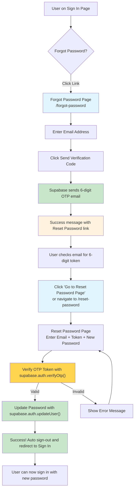

# Password Reset Flow Documentation

This document describes the password reset functionality implemented for users who are not logged in.

## Overview

The password reset feature allows users to securely reset their passwords using OTP (One-Time Password) token verification when they've forgotten their credentials and are not currently logged in to the application.

**Security Enhancement:** This implementation uses token-based verification instead of automatic login links, preventing unauthorized access even if someone gains access to the user's email.

## User Flow

## Technical Implementation

### Routes

- `/forgot-password` - Password reset request page
- `/reset-password` - Password reset completion page

### Components

- **ForgotPasswordForm** - Handles email input and reset request
- **ResetPasswordForm** - Handles new password input with confirmation
- **Auth Context** - Extended with `resetPassword()` and `verifyResetToken()` methods

### Security Features

- **OTP Token-based verification** - Uses 6-digit one-time passwords instead of auto-login links
- **Manual token verification** - Users must manually enter token from email
- **No automatic sessions** - Prevents unauthorized access even with email access
- **Password requirements** - Enforces minimum 6 character passwords
- **Confirmation matching** - Ensures password and confirmation match
- **Token expiration** - Tokens automatically expire for security

### Error Handling

- Invalid or expired tokens show appropriate error messages
- Network errors are handled gracefully with toast notifications
- Users can request new reset links if their current link is invalid

## Step-by-Step Process

1. **Initiate Reset**
   - User clicks "Forgot password?" link on sign-in page
   - Navigates to `/forgot-password`

2. **Request Reset Email**
   - User enters their email address
   - App calls `supabase.auth.resetPasswordForEmail()`
   - Supabase sends email with 6-digit OTP token
   - User sees success message with link to Reset Password page

3. **Navigate to Reset Password**
   - User clicks "Go to Reset Password Page" button or link
   - Navigates to `/reset-password` manually
   - No automatic redirect from email

4. **Token Verification & Password Update**
   - User enters their email address
   - User enters 6-digit OTP token from email
   - User enters new password and confirmation
   - App validates password requirements locally
   - App calls `supabase.auth.verifyOtp()` to verify token
   - If valid, calls `supabase.auth.updateUser()` to update password

5. **Completion**
   - Success message displayed
   - User redirected to sign-in page after 2 seconds
   - User can now sign in with new password

## Toast Notifications

The system provides clear feedback through toast notifications:

- **Reset Email Sent** - Confirms email was sent successfully
- **Password Updated** - Confirms password was changed
- **Error Messages** - Shows specific error details for failures

## Files Modified/Created

### New Files
- `src/components/auth/ForgotPasswordForm.tsx`
- `src/components/auth/ResetPasswordForm.tsx`
- `src/pages/ForgotPassword.tsx`
- `src/pages/ResetPassword.tsx`

### Modified Files
- `src/contexts/AuthContext.tsx` - Added password reset methods
- `src/utils/toast-helpers.ts` - Added password reset toast methods
- `src/components/auth/SignInForm.tsx` - Added "Forgot password?" link
- `src/App.tsx` - Added new routes

## Testing

The implementation is fully typed with TypeScript and builds successfully. All components follow the existing patterns and styling conventions in the codebase.

To test the flow:
1. Start the development server with `npm run dev`
2. Navigate to the sign-in page
3. Click "Forgot password?" link
4. Enter a valid email address
5. Check email for 6-digit OTP token
6. Go to Reset Password page (via button or direct navigation)
7. Enter email, OTP token, and new password to complete reset
