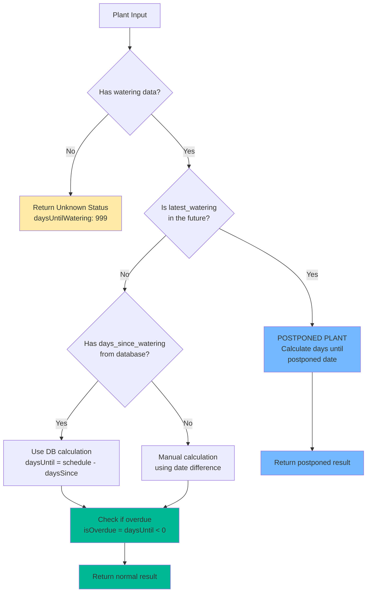

# Plant Care Schedules Documentation

## Overview

The SproutHub plant care scheduling system provides intelligent watering recommendations through a combination of basic scheduling algorithms, smart environmental factor analysis, and overwatering prevention mechanisms. This system helps users maintain healthy plants while preventing common care mistakes.

## Architecture

The scheduling system consists of three main components:

1. **Basic Watering Schedule Calculation** (`src/utils/watering-schedule.ts`)
2. **Smart Watering Algorithm** (`src/utils/smartWateringSchedule.ts`)
3. **Overwatering Detection & Prevention** (`src/utils/overwatering.ts`)

## Basic Watering Schedule System

### Core Algorithm

The basic scheduling system determines when plants need water based on their last watering date and suggested watering interval.

#### Key Interfaces

```typescript
interface PlantWateringInfo {
  latest_watering?: string | null;          // ISO date of last watering
  days_since_watering?: number | null;     // Database-calculated days since watering
  suggested_watering_days?: number | null; // Base watering interval
}

interface WateringCalculation {
  daysUntilWatering: number;       // Days until next watering (negative = overdue)
  isPostponed: boolean;            // True if watering was postponed to future date
  isOverdue: boolean;              // True if plant should have been watered already
  hasUnknownWateringDate: boolean; // True if no watering history exists
  effectiveLastWatering?: string;  // The date used for calculations
}
```

#### Calculation Logic

The `calculateWateringSchedule()` function follows this decision tree:



#### Schedule States

1. **Unknown Schedule** (`hasUnknownWateringDate: true`)
   - No watering history exists
   - `daysUntilWatering: 999` (large number to indicate low priority)
   - Used for newly added plants

2. **Normal Schedule** (`isPostponed: false`)
   - Plant follows regular watering cycle
   - `daysUntilWatering` calculated as: `suggested_days - days_since_watering`
   - Can be positive (future), zero (due today), or negative (overdue)

3. **Postponed Schedule** (`isPostponed: true`)
   - Plant watering was delayed to a future date
   - `latest_watering` contains future timestamp
   - `daysUntilWatering` shows days until postponed date

4. **Overdue Schedule** (`isOverdue: true`)
   - Plant should have been watered already
   - `daysUntilWatering` is negative
   - Requires immediate attention

### Postponement System

The postponement feature allows users to delay watering without losing track of the schedule:

#### How Postponement Works

1. **User Action**: User selects "postpone" instead of watering
2. **Database Update**: `latest_watering` is set to future date
3. **Schedule Calculation**: System detects future date and treats as postponed
4. **Status Display**: Shows "Postponed until [date]" instead of regular schedule

#### Postponement Benefits

- **Prevents Schedule Reset**: Unlike skipping, postponement maintains the original schedule context
- **Clear Intent**: Distinguishes between forgotten waterings and intentional delays
- **Accurate Tracking**: Overwatering detection ignores postponement records

## Smart Watering System

The smart watering system enhances basic scheduling by considering environmental and care factors.

### Environmental Factors

The system analyzes seven key factors that affect plant water needs:

#### 1. Plant Size
- **Small** (-1 day): Less soil volume, faster drying
- **Medium** (baseline): Standard adjustment
- **Large** (+2 days): More soil volume, better moisture retention

#### 2. Light Level
- **Low** (-1 day): Reduced photosynthesis and water consumption
- **Medium** (baseline): Standard light conditions
- **High** (+1 day): Increased photosynthesis and evaporation

#### 3. Temperature
- **Cool** (-1 day): Slower evaporation rate
- **Normal** (baseline): Standard temperature
- **Warm** (+1 day): Increased evaporation rate

#### 4. Humidity
- **Dry** (+2 days): Increased water loss through transpiration
- **Normal** (baseline): Standard humidity
- **Humid** (-1 day): Reduced water loss

#### 5. Seasonal Adjustments
- **Winter** (+3 days): Plant dormancy significantly reduces water needs
- **Spring** (baseline): Active growing season
- **Summer** (-1 day): Peak growth increases water consumption
- **Fall** (+1 day): Slowing metabolism

#### 6. Care Style
- **Frequent** (-1 day): Adjusted for hands-on care preference
- **Balanced** (baseline): Standard care approach
- **Minimal** (+1 day): Low-maintenance scheduling

#### 7. Soil Type
- **Well-draining** (-1 day): Dries out faster
- **Regular** (baseline): Standard potting mix
- **Moisture-retaining** (+2 days): Stays wet longer

### Smart Schedule Calculation

```typescript
interface SmartScheduleResult {
  recommendedDays: number;      // Final recommendation (2-45 day range)
  baseDays: number;            // Original plant schedule
  adjustmentReasons: string[]; // Human-readable explanations
  totalAdjustment: number;     // Sum of all factor adjustments
  confidence: 'low' | 'medium' | 'high'; // Algorithm confidence
}
```

#### Algorithm Process

1. **Start with Base Schedule**: Use plant's catalog watering interval
2. **Apply Factor Adjustments**: Add/subtract days based on environmental factors
3. **Apply Safety Bounds**: Ensure result stays within 2-45 day range
4. **Calculate Confidence**: Based on total adjustment magnitude
   - High confidence: ±0-2 days adjustment
   - Medium confidence: ±3-4 days adjustment  
   - Low confidence: ±5+ days adjustment

### Integration with Basic System

Smart watering recommendations can be applied to plants in two ways:

1. **Temporary Application**: Used for one-time watering decisions
2. **Schedule Override**: Permanently updates plant's `suggested_watering_days`

## Overwatering Detection & Prevention

The overwatering system monitors watering patterns to prevent plant damage from excessive care.

### Risk Assessment Algorithm

#### Detection Window

The system analyzes recent watering history within a dynamic window:
- **Window Size**: `Math.min(Math.max(suggested_days, 2), 30)` days
- **Minimum Window**: 2 days (for frequent waterers)
- **Maximum Window**: 30 days (prevents excessive data analysis)

#### Risk Factors

1. **Frequency Count**
   - **None**: 0-1 waterings in window
   - **Low**: 2 waterings in window
   - **High**: 3+ waterings in window

2. **Average Interval Analysis**
   - Calculates average days between recent waterings
   - **Risk Escalation**: If average interval < 50% of suggested schedule
   - Uses last 5 intervals for calculation stability

#### Risk Levels

```typescript
interface OverwateringRisk {
  level: 'none' | 'low' | 'high';
  count: number;           // Waterings in window
  windowDays: number;      // Analysis window size
  avgIntervalDays?: number; // Average days between waterings
}
```

### Warning System

#### Immediate Warnings

The `shouldShowOverwateringWarning()` function provides instant feedback:

- **Too Recent**: Watered within last 2 days
- **Too Frequent**: Interval < 50% of suggested schedule
- **Skips Postponed**: Ignores future-dated waterings

#### User Notifications

- **Throttled Alerts**: Maximum one warning per plant per day
- **Contextual Messages**: Include specific watering counts and intervals
- **Actionable Advice**: Suggests postponement for high-risk plants

### Data Filtering

The system intelligently filters watering records:

1. **Excludes Postponements**: Records with `POSTPONEMENT:` in notes
2. **Date Validation**: Only counts past waterings within analysis window
3. **Chronological Sorting**: Orders records for accurate interval calculation

## Schedule Status Display

### Status Categories

The UI displays different watering statuses based on calculation results:

#### 1. Unknown Schedule
- **Display**: "Unknown schedule"
- **Color**: Neutral/gray
- **Priority**: Low (appears last in lists)

#### 2. Healthy Schedule
- **Display**: "Water in X days"
- **Color**: Green
- **Priority**: Normal

#### 3. Due Today
- **Display**: "Due today" or "Watered today"
- **Color**: Yellow/orange
- **Priority**: Medium
- **Logic**: Shows "Watered today" if watered within 12 hours

#### 4. Overdue
- **Display**: "Overdue by X days"
- **Color**: Red
- **Priority**: High (appears first in lists)

#### 5. Postponed
- **Display**: "Postponed until tomorrow" or specific date
- **Color**: Blue
- **Priority**: Medium (grouped with due today)

### Priority Sorting

The Dashboard sorts plants for task lists using this hierarchy:

1. **Overdue Plants** (most overdue first)
2. **Due Today Plants** 
3. **Postponed Plants**
4. **Healthy Plants** (by days until watering)
5. **Unknown Plants** (last)

## Database Integration

### Data Sources

#### Plants Table
```sql
-- Core plant watering data
suggested_watering_days  -- Base schedule from catalog
latest_watering         -- Most recent watering timestamp  
days_since_watering     -- Database-calculated field (updated via triggers)
```

#### Watering Records Table
```sql
-- Historical watering events
plant_id       -- Foreign key to plants
watered_at     -- Timestamp of watering event
notes          -- Optional notes (used for postponement tracking)
```

### Database Calculations

The system uses database triggers to maintain `days_since_watering`:

- **Automatically Updated**: When watering records are inserted/updated
- **Calendar Day Based**: Uses date differences, not precise timestamps
- **Null for Future Dates**: Postponed plants show null until watering date passes

## Testing & Quality Assurance

### Test Coverage

The scheduling system includes comprehensive tests:

#### Watering Schedule Tests (`watering-schedule.test.ts`)
- Normal watering scenarios
- Postponed plant handling
- Edge cases and data validation
- Component integration scenarios
- Push-to-tomorrow bug prevention

#### Overwatering Tests (`overwatering.test.ts`)
- Risk level calculations
- Window size validation
- Postponement exclusion
- Interval analysis accuracy

### Critical Bug Prevention

#### Postponement Schedule Reset Bug
- **Problem**: Postponed plants showing full schedule restart
- **Solution**: Explicit postponement detection in calculation logic
- **Tests**: Comprehensive postponement scenarios with time mocking

#### Overwatering False Positives
- **Problem**: Postponements triggering overwatering warnings
- **Solution**: Filter postponement records from risk analysis
- **Tests**: Postponement exclusion validation

## Performance Considerations

### Calculation Efficiency

1. **Database Optimization**: Uses pre-calculated `days_since_watering` when available
2. **Fallback Logic**: Manual calculation only when database field unavailable
3. **Caching**: Overwatering risk cached per plant to prevent repeated API calls

### Memory Management

1. **Bounded Analysis**: Overwatering window capped at 30 days
2. **Limited History**: Interval analysis uses last 5 waterings maximum
3. **Throttled Notifications**: Prevents notification spam via localStorage

## Future Enhancements

### Planned Features

1. **Weather Integration**: Adjust schedules based on humidity/temperature forecasts
2. **Machine Learning**: Learn from user behavior to improve recommendations
3. **Plant Health Correlation**: Adjust schedules based on plant health indicators
4. **Seasonal Automation**: Automatic seasonal adjustments based on location

### API Extensions

1. **Bulk Schedule Updates**: Efficiently update multiple plants
2. **Schedule History**: Track schedule changes over time
3. **Predictive Analytics**: Forecast optimal watering windows
4. **Integration Webhooks**: Connect with IoT devices and sensors

## Troubleshooting

### Common Issues

#### Plants Showing "Unknown Schedule"
- **Cause**: No watering history recorded
- **Solution**: Water plant once to initialize schedule
- **Prevention**: Default watering dates for new plants

#### Overwatering Warnings for Healthy Plants
- **Cause**: Recent schedule changes or irregular watering
- **Solution**: Wait 24 hours for throttling reset, or check watering history
- **Prevention**: Better user education on postponement feature

#### Postponed Plants Not Updating
- **Cause**: Browser time zone differences or date parsing issues
- **Solution**: Refresh application, check system time
- **Prevention**: Server-side date validation

### Debugging Tools

#### Console Logging
```typescript
// Enable detailed scheduling logs
localStorage.setItem('debug:watering', 'true');
```

#### Manual Calculations
```typescript
import { calculateWateringSchedule } from '@/utils/watering-schedule';

// Test specific plant calculation
const result = calculateWateringSchedule(plantData);
console.log('Schedule Result:', result);
```

#### Risk Assessment Testing
```typescript
import { computeOverwateringRisk } from '@/utils/overwatering';

// Test overwatering detection
const risk = computeOverwateringRisk({
  records: wateringHistory,
  suggestedDays: 7
});
console.log('Overwatering Risk:', risk);
```

## API Reference

### Core Functions

#### `calculateWateringSchedule(plant: PlantWateringInfo): WateringCalculation`
Primary function for determining plant watering status.

**Parameters:**
- `plant.latest_watering`: ISO date string of last watering
- `plant.days_since_watering`: Database-calculated days since watering  
- `plant.suggested_watering_days`: Base watering interval

**Returns:**
- `daysUntilWatering`: Days until next watering (negative = overdue)
- `isPostponed`: Whether plant watering was postponed
- `isOverdue`: Whether plant is overdue for watering
- `hasUnknownWateringDate`: Whether plant has no watering history

#### `calculateSmartWateringSchedule(baseDays: number, factors: WateringFactors): SmartScheduleResult`
Calculates intelligent watering schedule based on environmental factors.

**Parameters:**
- `baseDays`: Original plant watering schedule
- `factors`: Environmental and care factors object

**Returns:**
- `recommendedDays`: Adjusted watering schedule
- `adjustmentReasons`: Human-readable explanation of changes
- `confidence`: Algorithm confidence level

#### `computeOverwateringRisk(params: {records, suggestedDays?, now?}): OverwateringRisk`
Analyzes watering history for overwatering risk.

**Parameters:**
- `records`: Array of watering records with `watered_at` timestamps
- `suggestedDays`: Plant's normal watering schedule (default: 7)
- `now`: Current date for calculations (default: new Date())

**Returns:**
- `level`: Risk level ('none', 'low', 'high')
- `count`: Number of waterings in analysis window
- `avgIntervalDays`: Average days between recent waterings

### Utility Functions

#### `shouldShowOverwateringWarning(lastWatered: string, suggestedDays: number): {showWarning: boolean, daysSinceLastWatered?: number}`
Determines if immediate overwatering warning should be displayed.

#### `getNextWateringDate(lastWatered: string, daysAgo: number, wateringSchedule: number, formatDate: Function): string`
Calculates and formats the next watering date for display.

#### `isPlantOverdue(daysAgo: number, wateringSchedule: number, hasLastWatered: boolean): boolean`
Legacy function for backward compatibility - determines if plant is overdue.

---

This documentation provides a comprehensive overview of the SproutHub plant care scheduling system. For implementation details, refer to the source code in `src/utils/` and the corresponding test files.
