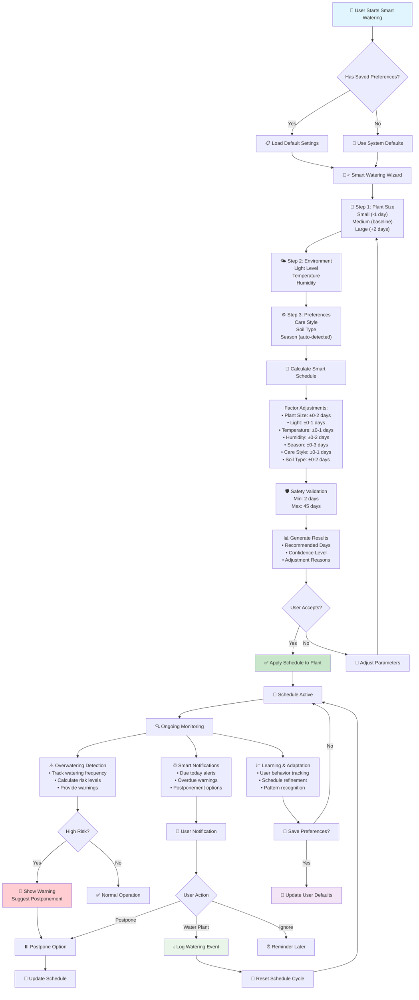

# Smart Watering System Documentation

## Overview

The Smart Watering System is an intelligent plant care feature that provides personalized watering recommendations based on environmental factors, plant characteristics, and user preferences. It combines AI-powered calculations with user behavior learning to optimize plant health while preventing overwatering.

## Core Features

### 🧠 Intelligent Scheduling
- **AI-Powered Recommendations**: Uses machine learning algorithms to calculate optimal watering schedules
- **Multi-Factor Analysis**: Considers 7 key environmental and plant factors
- **Confidence Scoring**: Provides high/medium/low confidence levels for each recommendation
- **Boundary Protection**: Ensures all recommendations stay within safe 2-45 day limits

### 🌱 Environmental Factor Integration
- **Plant Size**: Small, medium, or large plant considerations
- **Light Levels**: Low, medium, or high light environment analysis
- **Temperature**: Cool, normal, or warm temperature adjustments
- **Humidity**: Dry, normal, or humid air condition factors
- **Seasonal Awareness**: Automatic winter dormancy and summer growth adjustments
- **Care Style**: Frequent, balanced, or minimal care preference adaptation
- **Soil Type**: Regular, well-draining, or moisture-retaining soil considerations

### 👤 User Personalization
- **Default Preferences**: Save environmental conditions for consistent recommendations
- **Location-Based Adjustments**: Optional location data for seasonal accuracy
- **Care Style Learning**: Adapts to individual user watering habits
- **Preference Persistence**: Saved settings apply across all plants

### 🛡️ Safety Features
- **Overwatering Detection**: Monitors watering frequency patterns
- **Risk Assessment**: Calculates overwatering risk levels (none/low/high)
- **Smart Postponement**: Allows intelligent delay of watering schedules
- **Notification Throttling**: Prevents spam notifications for overwatered plants

## Smart Watering Flow

The following diagram illustrates the complete smart watering process from user initiation to ongoing monitoring:



### Step 1: User Setup (Optional)
Users can configure default environmental preferences through the Smart Watering Preferences Dialog:

```typescript
interface UserWateringPreferences {
  default_light_level: 'low' | 'medium' | 'high';
  default_temperature: 'cool' | 'normal' | 'warm';
  default_humidity: 'dry' | 'normal' | 'humid';
  default_care_style: 'frequent' | 'balanced' | 'minimal';
  default_soil_type: 'regular' | 'draining' | 'retaining';
  location?: string;
}
```

### Step 2: Smart Watering Wizard
The 4-step wizard process:

1. **Plant Size Selection**: Choose plant size category
2. **Environmental Conditions**: Set light, temperature, and humidity
3. **Care Preferences**: Select care style and soil type
4. **Results & Application**: View recommendations and apply schedule

### Step 3: Schedule Calculation
The algorithm processes multiple factors:

#### Factor Adjustments
- **Plant Size**:
  - Small: -1 day (less soil volume, faster drying)
  - Large: +2 days (more soil volume, moisture retention)
  - Medium: Baseline (no adjustment)

- **Light Level**:
  - High: +1 day (increased photosynthesis and evaporation)
  - Low: -1 day (reduced metabolism and water consumption)
  - Medium: Baseline

- **Temperature**:
  - Warm: +1 day (increased evaporation rate)
  - Cool: -1 day (slower evaporation)
  - Normal: Baseline

- **Humidity**:
  - Dry: +2 days (increased transpiration)
  - Humid: -1 day (reduced water loss)
  - Normal: Baseline

- **Season**:
  - Winter: +3 days (dormancy period)
  - Summer: -1 day (active growth)
  - Spring/Fall: Moderate adjustments

- **Care Style**:
  - Frequent: -1 day (hands-on preference)
  - Minimal: +1 day (low-maintenance style)
  - Balanced: Baseline

- **Soil Type**:
  - Draining: -1 day (faster moisture loss)
  - Retaining: +2 days (longer moisture retention)
  - Regular: Baseline

### Step 4: Safety Validation
- Apply minimum 2-day and maximum 45-day bounds
- Calculate confidence level based on adjustment magnitude
- Generate explanatory reasons for transparency

### Step 5: Ongoing Monitoring
- Track actual vs. recommended watering intervals
- Assess overwatering risk patterns
- Provide postponement options when appropriate
- Learn from user behavior patterns

## Technical Implementation

### Core Components

#### `SmartWateringWizard.tsx`
Multi-step wizard interface for gathering environmental factors and displaying recommendations.

#### `SmartWateringPreferencesDialog.tsx`
User preference management interface for setting default environmental conditions.

#### `smartWateringSchedule.ts`
Core algorithm implementation containing:
- `calculateSmartWateringSchedule()`: Main calculation function
- `WateringFactors` interface: Environmental factor definitions
- `SmartScheduleResult` interface: Recommendation output format

#### `useSmartWateringPreferences.ts`
React hook for managing user preferences:
- Load/save/clear preference operations
- Database integration with Supabase
- Default factor generation

#### `overwatering.ts`
Risk assessment utilities:
- Frequency pattern analysis
- Risk level calculation
- Safety threshold management

### Database Schema

The system uses a `user_watering_preferences` table with the following structure:

```sql
CREATE TABLE user_watering_preferences (
  id UUID PRIMARY KEY,
  user_id UUID REFERENCES auth.users(id),
  default_light_level TEXT,
  default_temperature TEXT,
  default_humidity TEXT,
  default_care_style TEXT,
  default_soil_type TEXT,
  location TEXT,
  created_at TIMESTAMP,
  updated_at TIMESTAMP
);
```

## Integration Points

### Plant Management
- **Plant Cards**: Display watering status with smart recommendations
- **Plant Details**: Access smart wizard for schedule customization
- **Dashboard**: Show prioritized watering needs across all plants

### Room Organization
- **Room Views**: Group plants by watering requirements
- **Batch Operations**: Apply smart schedules to multiple plants
- **Health Statistics**: Room-level watering health metrics

### Notification System
- **Smart Timing**: Intelligent notification scheduling
- **Risk Alerts**: Overwatering warnings and recommendations
- **Postponement Tracking**: Manage delayed watering schedules

## Benefits

### For Users
1. **Personalized Care**: Tailored recommendations for individual environments
2. **Plant Health**: Optimized watering prevents both under and overwatering
3. **Time Saving**: Automated scheduling reduces mental overhead
4. **Learning System**: Improves recommendations over time
5. **Flexibility**: Postponement and custom adjustment options

### For Plant Health
1. **Optimal Hydration**: Science-based watering frequency
2. **Seasonal Adaptation**: Automatic adjustments for plant cycles
3. **Overwatering Prevention**: Built-in safety mechanisms
4. **Environmental Awareness**: Considers real-world growing conditions
5. **Individual Needs**: Accounts for plant-specific requirements

## Future Enhancements

### Planned Features
- **Weather API Integration**: Real-time environmental data
- **Plant-Specific Learning**: Individual plant response tracking
- **Advanced Analytics**: Detailed watering history insights
- **Automated Seasonal Adjustments**: Dynamic schedule updates
- **Smart Notifications**: Context-aware reminder timing

### Potential Integrations
- **IoT Sensors**: Soil moisture and environmental monitoring
- **Weather Services**: Local climate data integration
- **Calendar Apps**: Schedule coordination and reminders
- **Health Tracking**: Correlation with plant health metrics
- **Community Features**: Shared recommendations and tips

## Testing

The smart watering system includes comprehensive unit tests covering:
- Schedule calculation accuracy
- Factor adjustment logic
- Boundary condition handling
- Risk assessment algorithms
- Preference management operations

Test files:
- `src/utils/__tests__/smartWateringSchedule.test.ts`
- `src/utils/__tests__/overwatering.test.ts`

## Conclusion

The Smart Watering System represents a sophisticated approach to plant care automation, combining environmental science with user experience design. By considering multiple factors and learning from user behavior, it provides intelligent, personalized recommendations that promote healthy plant growth while preventing common watering mistakes.

The system's modular design allows for future enhancements while maintaining reliability and user-friendliness. Its integration with the broader SproutHub ecosystem creates a comprehensive plant care management experience.
